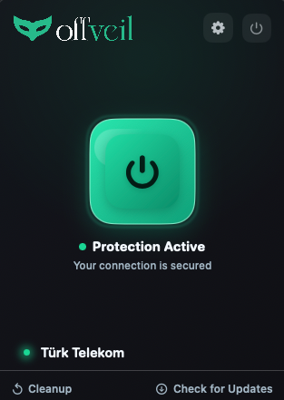
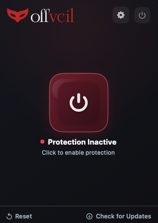
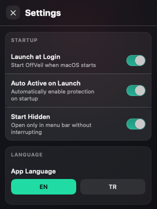
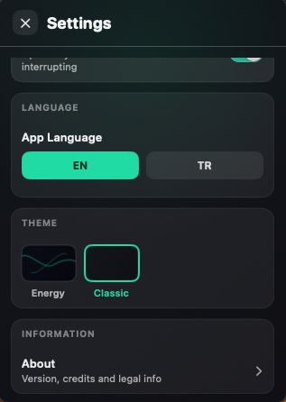

  
</p>

<h3 align="center">
  macOS için Native DPI aşma motoru - VPN yok, harici sunucu yok, hız kaybı yok.
</h3>

<p align="center">
  <a href="https://github.com/berkaykyb/offveil-macOS/releases"></a>
  <a href="LICENSE"></a>
  <a href="https://github.com/berkaykyb/offveil-macOS/stargazers"></a>
  <a href="https://github.com/berkaykyb/offveil-macOS/releases"></a>
</p>

<p align="center">
  <a href="README.md">English</a>
</p>
<p align="center">
  <blockquote>
    <strong>Bu, <a href="https://github.com/erayselim/offveil">OffVeil Windows</a>'un resmi macOS karşılığıdır.</strong> Platformlar farklı olsa da misyonumuz aynı: Perdeyi (veil) kaldırmak ve açık internet ile aranızdaki engelleri yok etmek.
  </blockquote>
</p>

---

## offveil Nedir?

**offveil** (off the veil - *perdenin ötesi*), **Derin Paket İncelemesi (DPI)** kısıtlamalarını zahmetsizce aşmak için tasarlanmış hafif bir sistem tepsisi (menu bar) uygulamasıdır.

Geleneksel VPN'lerin aksine, OffVeil **trafiğinizi asla üçüncü taraf sunucular üzerinden yönlendirmez**. Tamamen yerel makinenizde çalışır. Bağlantınız doğrudan kalır ve indirme/yükleme hızlarınızdan ödün verilmez - değişen tek şey, İSS'lerin (İnternet Servis Sağlayıcıları) trafiğinizi alan adlarına (SNI) göre artık inceleyememesi veya engelleyememesidir.

Her şey cihazınızda gerçekleşir; bu da maksimum gizlilik ve sıfır gecikme anlamına gelir.

---

## Özellikler

- **Tek Tıkla Koruma:** Menü çubuğundan tek bir tuşla bağlantınızı anında güvence altına alır.
- **Akıllı Ağ Yönetimi:** Ağ durumundaki değişiklikleri otomatik olarak algılar (Wi-Fi ↔ Ethernet, uyku modu/uyanma) ve korumayı sorunsuzca yeniden başlatır.
- **Sağlam Kurtarma (Recovery):** Yerleşik bir denetleme süreci (watchdog), uygulama beklenmedik şekilde kapansa bile sistem proxy ayarlarınızın her zaman temiz ve sorunsuz bir şekilde eski haline getirilmesini sağlar.
- **Otomatik Yapılandırma:** Herhangi bir manuel terminal komutu gerektirmeden macOS sistem proxy ayarlarını (`networksetup`) dinamik olarak yönetir.
- **Enerji Verimli:** macOS için özel olarak üretilmiştir, minimum sistem kaynağı tüketimiyle arka planda sessizce çalışır.
- **Otomatik Güncelleme:** GitHub Releases üzerinden entegre güncelleme mekanizması.

---

## Ekran Görüntüleri

<table>
  <tr>
    <th align="center">Koruma Aktif</th>
    <th align="center">Koruma Pasif</th>
    <th align="center">Ayarlar - Genel</th>
    <th align="center">Ayarlar - Destek</th>
  </tr>
  <tr>
    <td align="center"></td>
    <td align="center"></td>
    <td align="center"></td>
    <td align="center"></td>
  </tr>
</table>

---

## Teknik Mimari ve v2.0 Vizyonu

Şu anda (v1.x sürümünde), OffVeil macOS temel paket işleme motoru olarak [SpoofDPI](https://github.com/xvzc/SpoofDPI)'ı kullanmaktadır. Uygulama yerel bir proxy (`127.0.0.1:18080`) kurar ve TLS ClientHello parçalama işlemini gerçekleştirmek için tüm sistem HTTP/HTTPS trafiğini otomatik olarak bu proxy üzerinden yönlendirir.

### Neden henüz kernel seviyesinde müdahale etmiyoruz?

OffVeil'in [Windows versiyonunun](https://github.com/erayselim/offveil) proxy'ye dayanmadan çekirdek (kernel) düzeyinde paketlere müdahale ettiğini (WinDivert kullanarak) fark edebilirsiniz.

Bu vizyonu macOS için de güçlü bir şekilde paylaşıyoruz. Ancak, Apple platformlarında kernel düzeyinde bir ağ filtresi geliştirmek bir **Network Extension (Ağ Uzantısı)** uygulamayı gerektirir. Apple, bu yetkiyi kesin ve katı bir şekilde **Apple Developer Programı** arkasında tutmaktadır. Aktif ve onaylanmış bir geliştirici hesabı olmadan, Network Extension içeren kodlar sıradan kullanıcı makinelerinde imzalanamaz, test edilemez veya çalıştırılamaz.

### v2.0 Vizyonumuz

Bugün kullanıcılara çalışan, güvenilir ve ücretsiz bir uygulama sunabilmek için SpoofDPI'dan yararlanan yerel proxy (local-proxy) mimarisini benimsedik. **Ancak bu geçici bir basamaktır.**

Bir Apple Geliştirici hesabı (Apple Developer Account) temin ettiğimizde acil yol haritamız şunları içermektedir:

1. Çekirdek (kernel) düzeyinde paket manipülasyonu için native, **Swift tabanlı bir Network Extension** geliştirmek.
2. Yerel HTTP proxy mimarisini tamamen terk etmek.
3. Felsefe olarak Windows muadilimizle tıpatıp aynı olan sıfır ek yük (zero-overhead) hiper-verimli bir DPI bypass mimarisine ulaşmak.

O zamana kadar OffVeil, macOS DPI bypass ekosisteminde bulunan en sağlam ve yönetilebilir arayüzü sunmaya devam edecek.

---

## Karşılaştırma

DPI bypass araçları genellikle komut satırı (CLI) uygulamaları etrafında şekillenmiştir. OffVeil, teknik etkinlik ile kullanıcı erişilebilirliği arasındaki bu boşluğu doldurmayı hedefler.

| Özellik | **offveil (macOS)** | **offveil (Windows)** | SpoofDPI | ByeDPI |
|---------|:-----------:|:-------------------:|:--------:|:------:|
| **Platform** | **macOS** | Windows | Win, Linux, macOS | Win, Linux, macOS |
| **Arayüz (UI)** | **Native GUI** | Native GUI | CLI (Terminal) | CLI (Terminal) |
| **Bypass Yöntemi** | **Yerel Proxy** *(v1)* | Kernel-level | HTTP Proxy | SOCKS Proxy |
| **Sistem Proxy Yön.**| **Otomatik** | Uygulanamaz (Kernel) | Manuel | Manuel |
| **Ağ Değişimi Tespiti**| **Otomatik** | Uygulanamaz | Manuel | Manuel |
| **Çökme Kurtarma** | **Otomatik** | Otomatik | Yok | Yok |
| **Oto-Güncelleme** | **Evet** | Evet | Hayır | Hayır |
| **Kullanım** | **Arka Plan Uygulaması**| Arka Plan Uygulaması | Terminal Oturumu | Terminal Oturumu |

---

## Kurulum

1. En guncel `offveil.dmg` dosyasini **[Releases (Surumler)](https://github.com/berkaykyb/offveil-macOS/releases)** sayfasindan indirin.
2. Indirilen `.dmg` dosyasini acin.
3. Icindeki **offveil** uygulamasini **Applications (Uygulamalar)** klasorune surukleyin.
4. **Ilk acilis icin:** offveil App Store uzerinden dagitilmadigi icin macOS tek seferlik bir onay gerektirir. **Terminal** uygulamasini acin ve asagidaki komutu yapistirin:
   ```bash
   xattr -cr /Applications/offveil.app
   ```
5. **offveil** uygulamasini Uygulamalar klasorunuzden acin.

Bu ilk kurulum adimlarindan sonra offveil tum sonraki acilislarda normal sekilde calisacaktir. Guncellemeler uygulama icinden otomatik olarak yapilir.

*macOS 13 Ventura veya daha guncel bir surum gerektirir. Apple Silicon (M serisi) ve Intel islemcili cihazlarda tamamen yerel (native) olarak calisir.*

---

## Teknolojik Altyapı

| Bileşen | Teknoloji |
|-------|-----------|
| **Kullanıcı Arayüzü (UI)** | SwiftUI |
| **Durum ve Yaşam Döngüsü** | Python 3 (PyInstaller ile binary olarak derlenmiştir) |
| **Proxy Motoru** | [SpoofDPI](https://github.com/xvzc/SpoofDPI) (Go binary) |
| **Ağ Yönlendirmesi** | `Network.framework` (macOS yerleşik), `networksetup` CLI |

---

## Projemize Destek Olun

Eğer offveil sizin için perdeyi kaldırmayı ve açık internete erişiminizi sorunsuzca sağlamayı başardıysa, projemizin büyümesi için yapabileceğiniz en basit ve etkili şey bu depoyu (repository) **Yıldızlamaktır (Star ⭐)**. Bu, projenin görünürlüğünü artırır ve benzer sansürlerle karşılaşan diğer kullanıcıların aracı keşfetmesine yardımcı olur.

<p align="center">
  <a href="https://github.com/berkaykyb/offveil-macOS/stargazers">
    
  </a>
</p>

---

## Teşekkürler ve Lisans

Bu proje **Tüm Hakları Saklıdır (All Rights Reserved)** lisansı altındadır. Kaynak kodu şeffaflık ve eğitim amaçlı olarak GitHub'da herkese açık tutulmaktadır. Yazarın açık yazılı izni olmadan kodu kopyalamak, değiştirmek veya dağıtmak yasaktır. Detaylar için [LICENSE](LICENSE) dosyasına bakabilirsiniz.

OffVeil (macOS) v1.x, temel paket parçalama yetenekleri için açık kaynaklı **[SpoofDPI](https://github.com/xvzc/SpoofDPI)** projesini ([@xvzc](https://github.com/xvzc)) kullanmaktadır. SpoofDPI uygulaması [Apache License 2.0](https://github.com/xvzc/SpoofDPI/blob/main/LICENSE) lisansına sahiptir.

Bu araç setinin vizyonunu ortaya koyan ve [OffVeil Windows](https://github.com/erayselim/offveil) sürümünün yaratıcısı olan takım arkadaşım **[@erayselim](https://github.com/erayselim)**'e özel teşekkürler.

<p align="center">
  <sub>Perdeyi kaldırıyoruz. Açık webi geri getiriyoruz.</sub>
</p>
